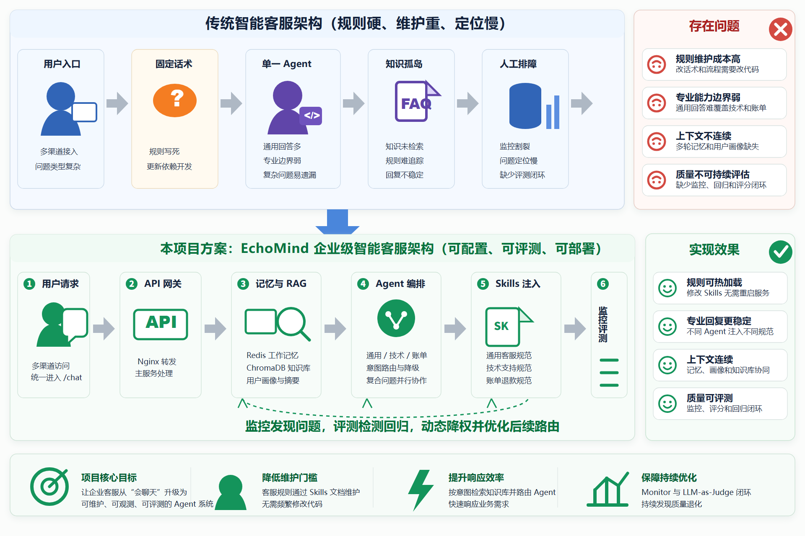
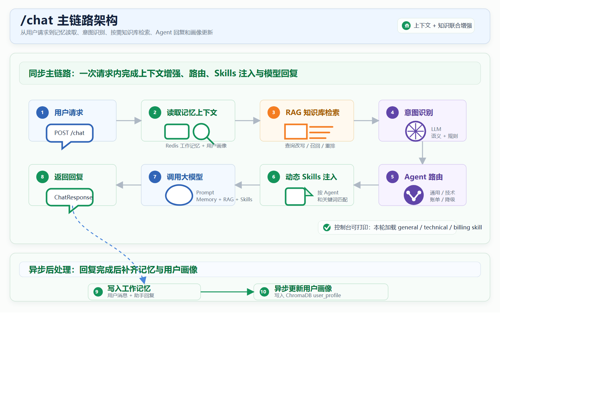
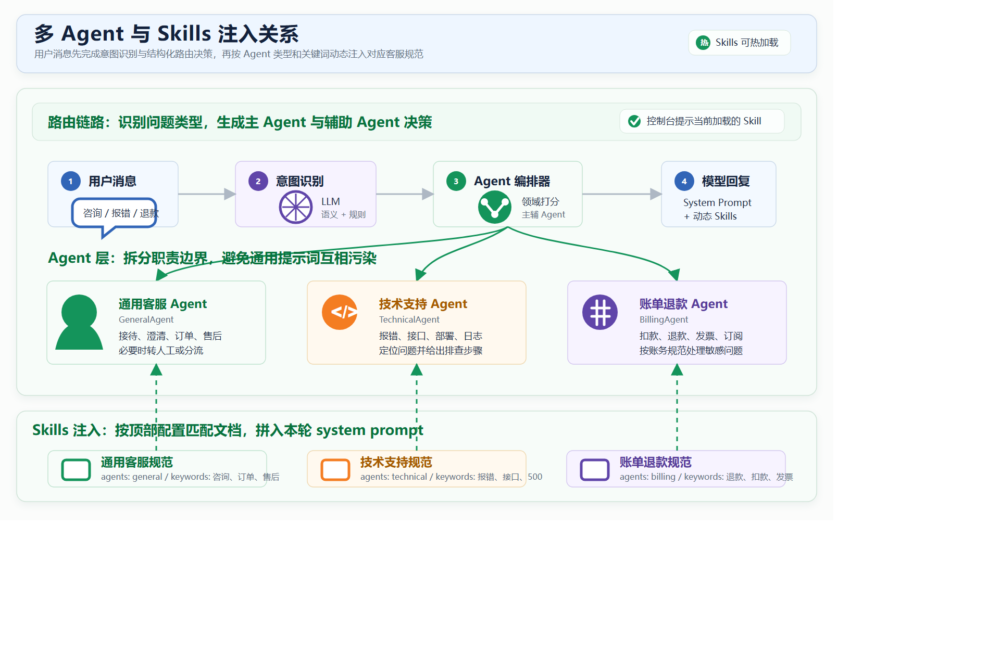
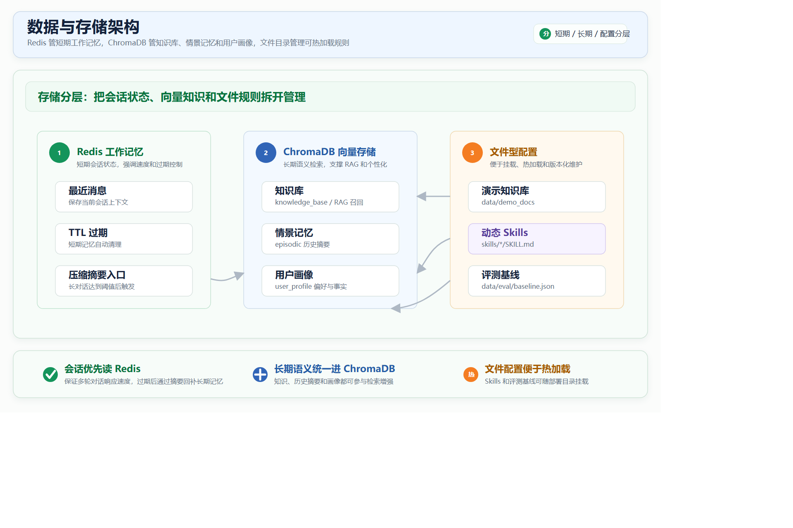
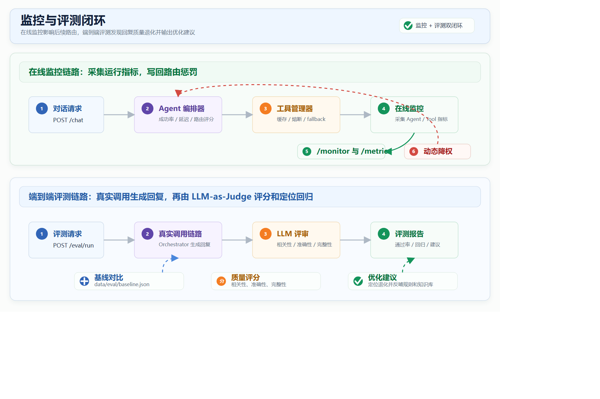
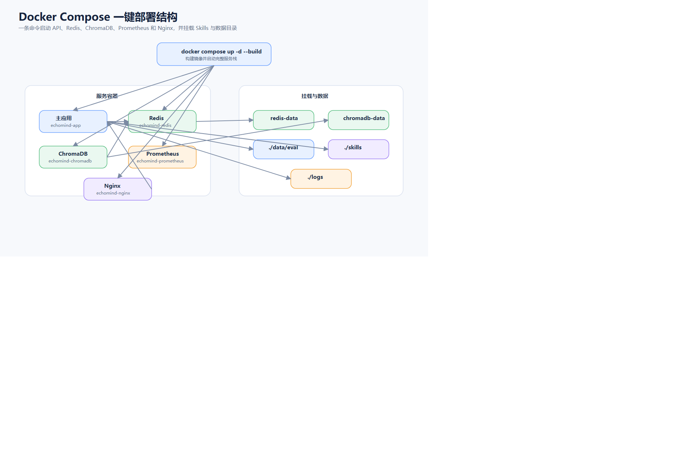

# EchoMind —— 企业智能运营协同中枢

> 可观测、可评测、可降级的多 Agent 智能客服/运营系统。

面向客服与运营场景，将 **意图识别 → 知识检索 → 多 Agent 编排 → 分层记忆 → 动态 Skills → 在线监控 → 端到端评测** 串成一个完整闭环，支持 Docker 一键部署。

## ✨ 核心特性

- **细粒度意图识别**：三路融合（规则 + LLM + 检索），输出 intent / intent_group / urgency / entities
- **路由驱动的多 Agent 编排**：General / Technical / Billing / Escalation 四类 Agent 按意图路由
- **意图驱动 RAG**：ChromaDB 知识库，按意图决定是否检索、检索什么
- **三级记忆**：Redis 工作记忆 + ChromaDB 情景记忆与用户画像
- **动态 Skills 注入**：业务规则热加载，无需改代码
- **在线监控与路由降权**：指标采集 + 超阈值告警 + 故障 Agent 自动降权
- **LLM-as-Judge 端到端评测**：意图识别与回复质量自动评测

## 🗺 系统架构



<details>
<summary>点击展开更多架构图：/chat 主链路 · 多 Agent 与 Skills · 数据存储 · 监控评测闭环 · 一键部署</summary>











</details>

## 🏗 技术栈

- 后端（核心）：Python · FastAPI · Redis · ChromaDB · Prometheus · Docker Compose
- 前端：Vue 3 · Vite
- 后端（Java 版）：Spring Boot（功能持续对齐中）
- 模型：Anthropic Claude / DeepSeek（可切换）

## 📁 仓库结构

| 目录 | 说明 |
|---|---|
| `EchoMind/` | Python 后端（核心实现，详细文档在 `EchoMind/wiki/`） |
| `EchoMindFrontend/` | Vue3 前端 |
| `EchoMindJava/` | Spring Boot 版本（迭代中） |

详细架构图见 [wiki/架构图](EchoMind/wiki/架构图.md)。

## 🚀 快速开始

```bash
cd EchoMind
cp .env.example .env        # 填入 ANTHROPIC_API_KEY
docker compose up -d --build
```

- API 文档：`http://localhost:8000/docs`
- 健康检查：`http://localhost:8000/health`

## 📚 文档导航

- [定位与技术亮点](EchoMind/wiki/EchoMind定位与技术亮点.md)
- [技术亮点](EchoMind/wiki/技术亮点.md)
- [业务流程说明](EchoMind/wiki/业务流程说明.md)
- [完整使用指南](EchoMind/wiki/完整使用指南.md)
- [架构图](EchoMind/wiki/架构图.md)
- [迭代记录](EchoMind/2026.08.29改动说明.md)

项目保持两周一迭代的更新频率，欢迎 issue 交流。
